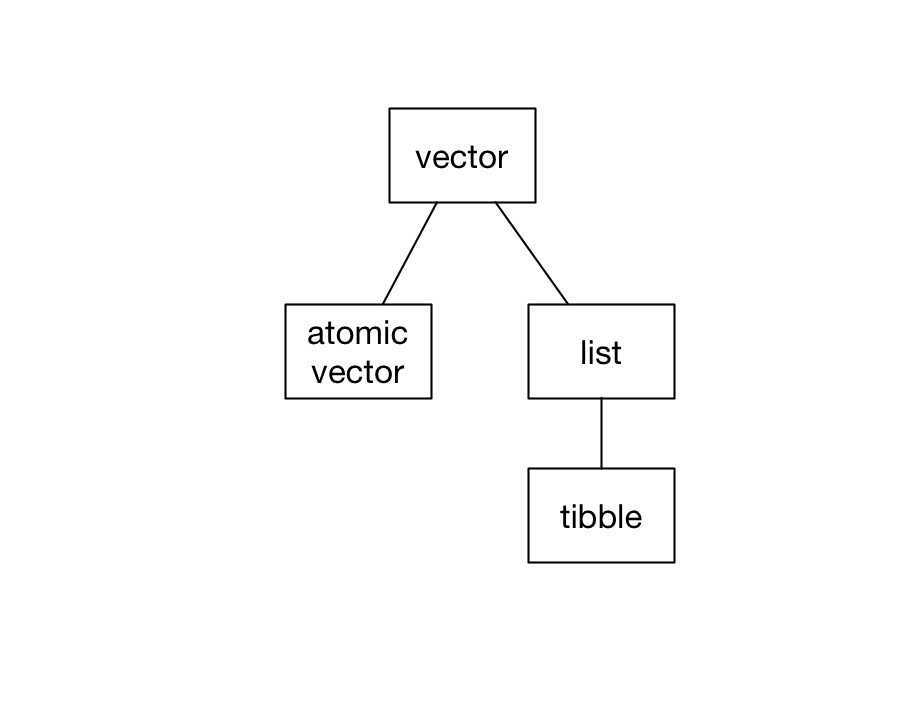
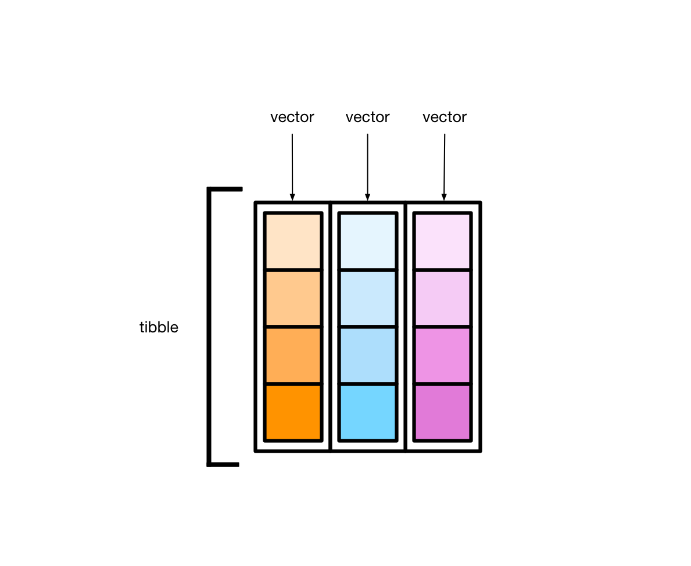

# Vectors, lists, and tibbles


```r
library(tidyverse)
```

In R, vectors are the most common data structure. In this book, we'll often represent vectors like this:


Each orange cell represents one element of the vector. As you'll see, different kinds of vectors can hold different kinds of elements.

There are two kinds of vectors: _atomic vectors_ and _lists_. _Tibbles_ are a specific kind of list.



In this chapter, we'll cover these three data structures, explaining how they differ and showing you how to manipulate each one.

## Atomic vectors

Atomic vectors are the "atoms" of R---the simple building blocks upon which all else is built. There are four types of atomic vector that are important for data analysis:

* __integer__ vectors (`<int>`) contain integers.
* __double__ vectors (`<dbl>`) contain real numbers. 
* __character__ vectors (`<chr>`) contain strings made with `""`.
* __logical__ vectors (`<lgl>`) contain `TRUE` or `FALSE`.

Integer atomic vectors contain only integers, double atomic vectors contain only doubles, and so on. Together, integer and double vectors are known as _numeric_ vectors. All vectors can also contain the missing value `NA`. 

In R, single numbers, logicals, and strings are just atomic vectors of length 1, so


```r
x <- "a"
```

creates a character vector. Likewise, 


```r
y <- 1.1
```

creates a double vector.

To create atomic vectors with more than one element, use `c()` to combine values.


```r
logical <- c(TRUE, FALSE, FALSE)

double <- c(1.5, 2.8, pi)

character <- c("this", "is", "a character", "vector")
```

To create an integer vector by hand, you'll need to add `L` to the end of each number.


```r
integer <- c(1L, 2L, 3L)
```

Without the `L`s, R will create a vector of doubles.

### Properties

Vectors (both atomic vectors and lists) all have two key properties: _type_ and _length_.

You can check the type of any vector with `typeof()`.


```r
typeof(c(1.5, 2.8, pi))
#> [1] "double"

typeof(c(1L, 3L, 4L))
#> [1] "integer"
```

Use `length()` to find a vector's length.


```r
length(c("a", "b", "c"))
#> [1] 3
```

Vector can also have named elements. 


```r
v_named <- c(guava = 2, pineapple = 4, dragonfruit = 1)
v_named
#>       guava   pineapple dragonfruit 
#>           2           4           1
```

You can access a vector's names with `names()`.


```r
names(v_named)
#> [1] "guava"       "pineapple"   "dragonfruit"
```

### Subsetting

`v` is an atomic vector of doubles. 


```r
v <- c(1, 2.7, 4, 5)
```

You can _subset_ `v` to create a new vector with selected elements, ignoring the others.

#### The `[` operator {-}

Here are four ways to subset `v` using the `[` operator.

##### Positive integers {-}

Subset with a vector of positive integers to extract elements by position. 


```r
v[c(1, 2)]
#> [1] 1.0 2.7
```

Note that, in R, indices start at 1, not 0, so the above code extracts the first two elements of `v`.

You can also use `:` to create a vector of adjacent integers. The following select the first three elements of `v`.


```r
v[1:3]
#> [1] 1.0 2.7 4.0
```

##### Negative integers {-}

Subset with a vector of negative integers to exclude elements. The following code removes the first and third elements of `v`.


```r
v[-c(1, 3)]
#> [1] 2.7 5.0
```

##### Names {-}

If a vector has names, you can subset with a character vector. 


```r
v_named[c("guava", "dragonfruit")]
#>       guava dragonfruit 
#>           2           1
```

##### Logical vectors {-}

If you supply a vector of `TRUE`s and `FALSE`s, `[` will select the elements that correspond to the `TRUE`s. 


The following extracts just the first and third elements. 


```r
v[c(TRUE, FALSE, TRUE, FALSE)]
#> [1] 1 4
```

You'll rarely subset by typing out `TRUE`s and `FALSE`s. Instead, you'll typically create a logical vector with a function or condition.

For example, the following code selects just the elements of `v` greater than 2.


```r
v[v > 2]
#> [1] 2.7 4.0 5.0
```

`v > 2` results in a logical vector the same length as `v`.


```r
v > 2
#> [1] FALSE  TRUE  TRUE  TRUE
```

`[` then uses this logical vector to subset `v`, resulting in just the elements of `v` greater than 2. 

`v_missing` has `NA`s.


```r
v_missing <- c(1.1, NA, 5, 6, NA)
```

We can pass `!is.na(v_missing)` into `[` to extract out just the non-`NA` elements.


```r
v_missing[!is.na(v_missing)]
#> [1] 1.1 5.0 6.0
```

#### The `[[` operator {-}

You can extract single elements from a vector with the `[[` operator.


```r
v[[2]]
#> [1] 2.7
```

You'll get an error if you try to use `[[` to select more than one element.


```r
v[[2:3]]
#> Error in v[[2:3]]: attempt to select more than one element in vectorIndex
```

For named vectors, the `[` operator creates a subset of the original vector with the specified elements.


```r
v_named["guava"]
#> guava 
#>     2
```

The `[[` operator returns only the extracted element.


```r
v_named[["guava"]]
#> [1] 2
```

As you'll see in the [Lists](#lists) section that the distinction between `[` and `[[` becomes more important with lists and tibbles. 

### Applying functions

Vectors are central to programming in R, and many R functions are designed to work with vectors. 

You already saw how to call `typeof()` to return the type of a vector. 


```r
typeof(v)
#> [1] "double"
```

`sum()` sums a vector's elements.


```r
sum(v)
#> [1] 12.7
```

You can use `sum()` with both numeric (i.e., double and integer) vectors, as well as with logical vectors.


```r
logical <- c(TRUE, TRUE, FALSE)

sum(logical)
#> [1] 2
```

When applied to a logical vector, `sum()` returns the number of `TRUE`s.

`mean()` works similarly.


```r
mean(v)
#> [1] 3.17

mean(logical)
#> [1] 0.667
```

The [Base R Cheat Sheet](https://github.com/dcl-docs/prog/blob/master/data/data-structure-basics/Cheat_sheet_base_R.pdf) has some other basic helpful functions, particularly under the _Vector Functions_ and _Math Functions_ sections. 

### Augmented vectors

Augmented vectors are atomic vectors with additional metadata. There are four important augmented vectors:

* __factors__ `<fct>`, which are used to represent categorical variables can take
  one of a fixed and known set of possible values (called the levels).
  
* __ordered factors__ `<ord>`, which are like factors but where the levels have an
  intrinsic ordering (i.e. it's reasonable to say that one level is "less than"
  or "greater than" another level).
  
* __dates__ `<dt>`, record a date.

* __date-times__ `<dttm>`, which are also known as POSIXct, record a date
  and a time.

For now, you just need to recognize these when you encounter them. You'll learn how to create each type of augmented vector later in the course.

## Lists

Unlike atomic vectors, which can only contain a single type, lists can contain any collection of R objects. 

### Basics

The following reading will introduce you to lists:

* [Recursive vectors (lists)](https://r4ds.had.co.nz/vectors.html#lists)

### Flattening

You can flatten a list into an atomic vector with `unlist()`.


```r
y <- list(1, 2, 4)
y
#> [[1]]
#> [1] 1
#> 
#> [[2]]
#> [1] 2
#> 
#> [[3]]
#> [1] 4
```


```r
unlist(y)
#> [1] 1 2 4
```

`unlist()` returns an atomic vector even if the original list contains other lists or vectors.


```r
z <- list(c(1, 2), c(3, 4))
z
#> [[1]]
#> [1] 1 2
#> 
#> [[2]]
#> [1] 3 4
```


```r
unlist(z)
#> [1] 1 2 3 4
```

## Tibbles

Tibbles are actually lists. 


```r
typeof(mpg)
#> [1] "list"
```

Every tibble is a named list of vectors, each of the same length.



These vectors form the tibble columns.

Take the tibble `mpg`.


```r
mpg
#> # A tibble: 234 × 11
#>   manufacturer model displ  year   cyl trans      drv     cty   hwy fl    class 
#>   <chr>        <chr> <dbl> <int> <int> <chr>      <chr> <int> <int> <chr> <chr> 
#> 1 audi         a4      1.8  1999     4 auto(l5)   f        18    29 p     compa…
#> 2 audi         a4      1.8  1999     4 manual(m5) f        21    29 p     compa…
#> 3 audi         a4      2    2008     4 manual(m6) f        20    31 p     compa…
#> 4 audi         a4      2    2008     4 auto(av)   f        21    30 p     compa…
#> 5 audi         a4      2.8  1999     6 auto(l5)   f        16    26 p     compa…
#> 6 audi         a4      2.8  1999     6 manual(m5) f        18    26 p     compa…
#> # … with 228 more rows
```

Each variable in `mpg` (`manufacturer`, `model`, `displ`, etc.) is a vector. `manufacturer` is a character vector, `displ` is a double vector, and so on. Each vector has length 234.

### Creation

There are two ways to create tibbles by hand. First, you can use `tibble()`. 


```r
my_tibble <- 
  tibble(
  x = c(1, 9, 5),
  y = c(TRUE, FALSE, FALSE),
  z = c("apple", "pear", "banana")
)

my_tibble
#> # A tibble: 3 × 3
#>       x y     z     
#>   <dbl> <lgl> <chr> 
#> 1     1 TRUE  apple 
#> 2     9 FALSE pear  
#> 3     5 FALSE banana
```

`tibble()` takes individual vectors and turns them into a tibble. 

Second, you can use `tribble()`.


```r
my_tibble <- 
  tribble(
    ~x,  ~y,    ~z,
     1,  TRUE,  "apple",
     9,  FALSE, "pear",
     5,  FALSE, "banana"
  )
    
my_tibble
#> # A tibble: 3 × 3
#>       x y     z     
#>   <dbl> <lgl> <chr> 
#> 1     1 TRUE  apple 
#> 2     9 FALSE pear  
#> 3     5 FALSE banana
```

For small datasets, `tribble()` is likely to be less error prone, since the values for each row are next to each other.

### Subsetting

There are several ways to extract variables out of tibbles. Tibbles are lists, so `[[` and `$` work.


```r
my_tibble[["x"]]
#> [1] 1 9 5

my_tibble$x
#> [1] 1 9 5
```

Use `pull()`, the dplyr equivalent, when you want to use a pipe.


```r
my_tibble %>% 
  pull(x)
#> [1] 1 9 5
```

Note that `pull()`, like `[[` and `$`, returns just the vector of values for a given variable.

`[` also works with tibbles.


```r
my_tibble["x"]
#> # A tibble: 3 × 1
#>       x
#>   <dbl>
#> 1     1
#> 2     9
#> 3     5
```

For a pipe, use the dplyr function `select()`.


```r
my_tibble %>% 
  select(x)
#> # A tibble: 3 × 1
#>       x
#>   <dbl>
#> 1     1
#> 2     9
#> 3     5
```

Whereas `pull()` returns a vector, `select()` returns a tibble.

### Dimensions

Printing a tibble tells you the column names and overall dimensions.


```r
mpg
#> # A tibble: 234 × 11
#>   manufacturer model displ  year   cyl trans      drv     cty   hwy fl    class 
#>   <chr>        <chr> <dbl> <int> <int> <chr>      <chr> <int> <int> <chr> <chr> 
#> 1 audi         a4      1.8  1999     4 auto(l5)   f        18    29 p     compa…
#> 2 audi         a4      1.8  1999     4 manual(m5) f        21    29 p     compa…
#> 3 audi         a4      2    2008     4 manual(m6) f        20    31 p     compa…
#> 4 audi         a4      2    2008     4 auto(av)   f        21    30 p     compa…
#> 5 audi         a4      2.8  1999     6 auto(l5)   f        16    26 p     compa…
#> 6 audi         a4      2.8  1999     6 manual(m5) f        18    26 p     compa…
#> # … with 228 more rows
```

To access the dimensions directly, you have three options:


```r
dim(diamonds)
#> [1] 53940    10

nrow(diamonds)
#> [1] 53940

ncol(diamonds)
#> [1] 10
```

To get the variable names, use `names()`:


```r
names(diamonds)
#>  [1] "carat"   "cut"     "color"   "clarity" "depth"   "table"   "price"  
#>  [8] "x"       "y"       "z"
```

