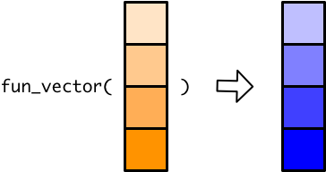

# Vector functions


```r
library(tidyverse)
```

**Vector functions** take a vector as input and produce a vector of the same length as output. 



Vector functions make working with vectors easy. For example, `log10()`, like most mathematical functions in R, is a vector function, which allows you to take the log of each element in a vector all at once. 


```r
x <- c(5, 2, 1)

log10(x)
#> [1] 0.699 0.301 0.000
```

The simple mathematical operators are also vector functions:


```r
y <- c(1, 2, 4)

x + y
#> [1] 6 4 5

x * y
#> [1] 5 4 4
```

In contrast, functions that can only take a length one input and produce a length one output are called **scalar functions**. 


As you'll see in the next section, the distinction between scalar and vector functions is important when working with tibbles.

## Temperature recommendations

A common way to create a scalar function is by using an if-else statement. For example, you might write the following function that tells you what to do based on the temperature outside:


```r
recommendation_1 <- function(x) {
  if (x >= 90) {
    "locate air conditioning"
  } else if (x >= 60) {
    "go outside"
  } else if (x >= 30) {
    "wear a jacket"
  } else if (x >= 0) {
    "wear multiple jackets"
  } else {
    "move"
  }
}
```

This works well when applied to single values,


```r
recommendation_1(92)
#> [1] "locate air conditioning"

recommendation_1(34)
#> [1] "wear a jacket"

recommendation_1(-15)
#> [1] "move"
```

but fails when applied to a vector with more than one element.


```r
temps <- c(1, 55, 101)

recommendation_1(temps)
#> Warning in if (x >= 90) {: the condition has length > 1 and only the first
#> element will be used
#> Warning in if (x >= 60) {: the condition has length > 1 and only the first
#> element will be used
#> Warning in if (x >= 30) {: the condition has length > 1 and only the first
#> element will be used
#> Warning in if (x >= 0) {: the condition has length > 1 and only the first
#> element will be used
#> [1] "wear multiple jackets"
```

`if` can only handle a single value, but we gave `recommendation_1()` a vector. Instead of producing an error, `if` just processed the first element of that vector and gave us a warning. 


## Vector functions and `mutate()`

Recall that a tibble is a list of vectors. Each column of the tibble is a vector, and all these vectors have to be the same length. New columns must also be vectors of the same length, which means that when you use `mutate()` to create a new column, `mutate()` has to create a new vector of the correct length. 

If you want, you can actually explicitly give `mutate()` a vector of the correct length. 


```r
set.seed(128)

df <- tibble(temperature = sample(x = -15:110, size = 5, replace = TRUE))

df %>% 
  mutate(new_column = c(1, 2, 3, 4, 5))
#> # A tibble: 5 × 2
#>   temperature new_column
#>         <int>      <dbl>
#> 1         -12          1
#> 2           2          2
#> 3          97          3
#> 4          66          4
#> 5          38          5
```

You can also give `mutate()` a single value, and it will repeat that value until it has a vector of the correct length. 


```r
df %>% 
  mutate(one_value = 1)
#> # A tibble: 5 × 2
#>   temperature one_value
#>         <int>     <dbl>
#> 1         -12         1
#> 2           2         1
#> 3          97         1
#> 4          66         1
#> 5          38         1
```

However, if you try to give `mutate()` a vector with a length other than 1 or `nrow(df)`, you'll get an error:


```r
df %>% 
  mutate(two_values = c(1, 2))
#> Error: Problem with `mutate()` column `two_values`.
#> ℹ `two_values = c(1, 2)`.
#> ℹ `two_values` must be size 5 or 1, not 2.
```

`mutate()` doesn't know how to turn a length 2 vector into a vector that has a value for each row in the tibble.

As you already know, you usually create new columns by applying functions to existing ones. Say we want to convert our temperatures from Fahrenheit to Celsius.


```r
fahrenheit_to_celsius <- function(degrees_fahrenheit) {
  (degrees_fahrenheit - 32) * (5 / 9)
}

df %>% 
  mutate(temperature_celsius = fahrenheit_to_celsius(temperature))
#> # A tibble: 5 × 2
#>   temperature temperature_celsius
#>         <int>               <dbl>
#> 1         -12              -24.4 
#> 2           2              -16.7 
#> 3          97               36.1 
#> 4          66               18.9 
#> 5          38                3.33
```

When you reference a column inside `mutate()`, you reference the entire vector. So when we pass `temperature` to `fahrenheit_to_celsius()`, we pass the entire `temperature` vector.


Mathematical operations are vectorized, so `fahrenheit_to_celsius()` takes the `temperature` vector and return a vector of the same length.


`mutate()` then takes this new vector and successfully adds a column to the tibble.


You can probably predict now what will happen if we try to use our scalar function, `recommendation_1()`, in the same way:


```r
df %>% 
  mutate(recommendation = recommendation_1(temperature))
#> Warning in if (x >= 90) {: the condition has length > 1 and only the first
#> element will be used
#> Warning in if (x >= 60) {: the condition has length > 1 and only the first
#> element will be used
#> Warning in if (x >= 30) {: the condition has length > 1 and only the first
#> element will be used
#> Warning in if (x >= 0) {: the condition has length > 1 and only the first
#> element will be used
#> # A tibble: 5 × 2
#>   temperature recommendation
#>         <int> <chr>         
#> 1         -12 move          
#> 2           2 move          
#> 3          97 move          
#> 4          66 move          
#> 5          38 move
```

`mutate()` passes the entire `temperature` vector to `recommendation_1()`, which can't handle a vector and so only processes the first element of `temperature`. 


However, because of how `mutate()` behaves when given a single value, the recommendation for the first temperature is copied for every single row.


This isn't very helpful, because now our tibble gives the same recommendation for every temperature. 

## Vectorizing if-else statements

There are several ways to vectorize `recommendation_1()` so that it gives an accurate recommendation for each temperature in `df`.

First, there's a vectorized if-else function called `if_else()`:


```r
x <- c(1, 3, 4)

if_else(x == 4, true = "four", false = "not four")
#> [1] "not four" "not four" "four"
```

However, in order to rewrite `recommendation_1()` using `if_else()`, we'd need to nest `if_else()` repeatedly and the function would become difficult to read. Another vector function, `case_when()`, is a better option.


```r
recommendation_2 <- function(x) {
  case_when(
    x >= 90 ~ "locate air conditioning",
    x >= 60 ~ "go outside",
    x >= 30 ~ "wear a jacket",
    x >= 0  ~ "wear multiple jackets",
    TRUE    ~ "move"
  )
}

recommendation_2(temps)
#> [1] "wear multiple jackets"   "wear a jacket"          
#> [3] "locate air conditioning"

df %>% 
  mutate(recommendation = recommendation_2(temperature))
#> # A tibble: 5 × 2
#>   temperature recommendation         
#>         <int> <chr>                  
#> 1         -12 move                   
#> 2           2 wear multiple jackets  
#> 3          97 locate air conditioning
#> 4          66 go outside             
#> 5          38 wear a jacket
```

For other helpful vector functions, take a look at the _Vector Functions_ section of the [dplyr cheat sheet](https://github.com/rstudio/cheatsheets/blob/master/data-transformation.pdf).
