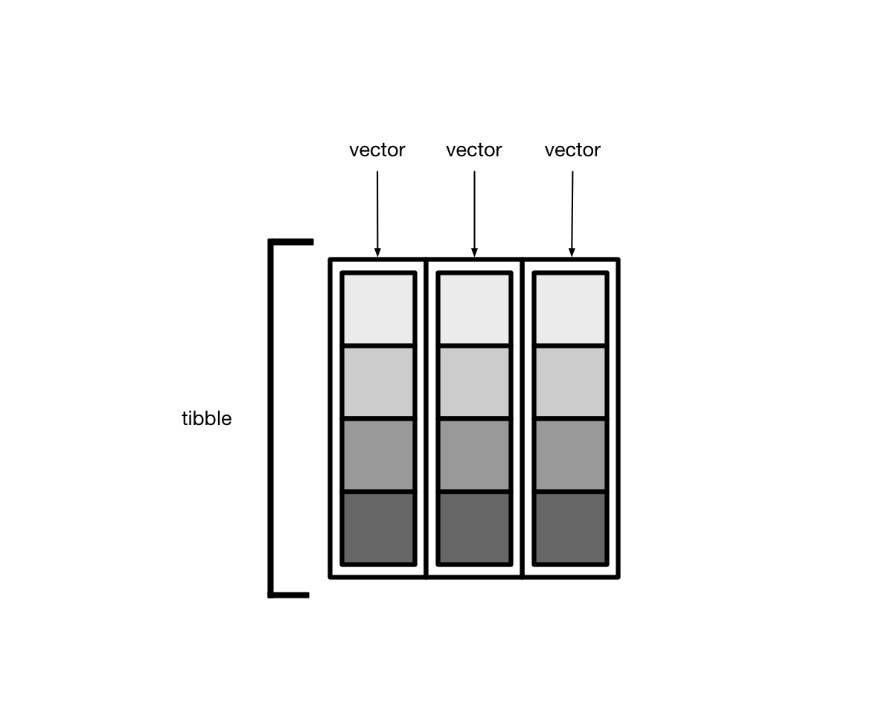

# List columns


```r
# Libraries
library(tidyverse)
#> ── Attaching packages ─────────────────────────────────────── tidyverse 1.3.1 ──
#> ✓ ggplot2 3.3.5     ✓ purrr   0.3.4
#> ✓ tibble  3.1.4     ✓ dplyr   1.0.7
#> ✓ tidyr   1.1.3     ✓ stringr 1.4.0
#> ✓ readr   2.0.1     ✓ forcats 0.5.1
#> ── Conflicts ────────────────────────────────────────── tidyverse_conflicts() ──
#> x dplyr::filter() masks stats::filter()
#> x dplyr::lag()    masks stats::lag()
library(dcldata)
```

Recall that tibbles are lists of vectors.



Usually, these vectors are _atomic vectors_, so the elements in the columns are single values, like "a" or 1.


Tibbles can also have columns that are lists. These columns are (appropriately) called _list columns_.


List columns are more flexible than normal, atomic vector columns. Lists can contain anything, so a list column can be made up of atomic vectors, other lists, tibbles, etc.


As you'll see, this can be a useful way to store data. In this chapter, you'll learn how to create list columns, how to turn list columns back into normal columns, and how to manipulate list columns. 

## Creating

Typically, you'll create list columns by manipulating an existing tibble. There are three primary ways to create list columns:

* `nest()`
* `summarize()` and `list()`
* `mutate()` and `map()`

### `nest()`

`countries` is a simplified version of `dcldata::gm_countries`, which contains Gapminder data on 197 countries.


```r
countries <-
  gm_countries %>% 
  select(name, region_gm4, un_status, un_admission, income_wb_2017)

countries
#> # A tibble: 197 × 5
#>   name                region_gm4 un_status un_admission income_wb_2017     
#>   <chr>               <chr>      <chr>     <date>       <chr>              
#> 1 Afghanistan         asia       member    1946-11-19   Low income         
#> 2 Albania             europe     member    1955-12-14   Upper middle income
#> 3 Algeria             africa     member    1962-10-08   Upper middle income
#> 4 Andorra             europe     member    1993-07-28   High income        
#> 5 Angola              africa     member    1976-12-01   Lower middle income
#> 6 Antigua and Barbuda americas   member    1981-11-11   High income        
#> # … with 191 more rows
```

The tidyr function `nest()` creates list columns of tibbles. 


Pass `nest()` the names of the columns to put into each individual tibble. `nest()` will create one row for each unique value of the remaining variables. For example, say we select just two columns from `countries`


```r
countries %>% 
  select(region_gm4, name) 
#> # A tibble: 197 × 2
#>   region_gm4 name               
#>   <chr>      <chr>              
#> 1 asia       Afghanistan        
#> 2 europe     Albania            
#> 3 africa     Algeria            
#> 4 europe     Andorra            
#> 5 africa     Angola             
#> 6 americas   Antigua and Barbuda
#> # … with 191 more rows
```

and then nest `name`.


```r
regions <-
  countries %>% 
  select(region_gm4, name) %>% 
  nest(countries = name)

regions
#> # A tibble: 4 × 2
#>   region_gm4 countries        
#>   <chr>      <list>           
#> 1 asia       <tibble [59 × 1]>
#> 2 europe     <tibble [49 × 1]>
#> 3 africa     <tibble [54 × 1]>
#> 4 americas   <tibble [35 × 1]>
```

`nest()` created one tibble for each `region_gm4`.


Each of these tibbles contains all the countries that belong to the continent.


```r
regions$countries[[1]]
#> # A tibble: 59 × 1
#>   name       
#>   <chr>      
#> 1 Afghanistan
#> 2 Australia  
#> 3 Bahrain    
#> 4 Bangladesh 
#> 5 Bhutan     
#> 6 Brunei     
#> # … with 53 more rows
```

The entire column is a list.


```r
typeof(regions$countries)
#> [1] "list"
```

If we nest multiple variables, the individual tibbles will have multiple columns. 


```r
regions_data <-
  countries %>% 
  nest(data = c(name, un_status, un_admission, income_wb_2017))

regions_data
#> # A tibble: 4 × 2
#>   region_gm4 data             
#>   <chr>      <list>           
#> 1 asia       <tibble [59 × 4]>
#> 2 europe     <tibble [49 × 4]>
#> 3 africa     <tibble [54 × 4]>
#> 4 americas   <tibble [35 × 4]>
```


```r
regions_data$data[[1]]
#> # A tibble: 59 × 4
#>   name        un_status un_admission income_wb_2017     
#>   <chr>       <chr>     <date>       <chr>              
#> 1 Afghanistan member    1946-11-19   Low income         
#> 2 Australia   member    1945-11-01   High income        
#> 3 Bahrain     member    1971-09-21   High income        
#> 4 Bangladesh  member    1974-09-17   Lower middle income
#> 5 Bhutan      member    1971-09-21   Lower middle income
#> 6 Brunei      member    1984-09-21   High income        
#> # … with 53 more rows
```

You can specify columns to nest using the same syntax as `select()`.


```r
countries %>% 
  nest(data = !region_gm4)
#> # A tibble: 4 × 2
#>   region_gm4 data             
#>   <chr>      <list>           
#> 1 asia       <tibble [59 × 4]>
#> 2 europe     <tibble [49 × 4]>
#> 3 africa     <tibble [54 × 4]>
#> 4 americas   <tibble [35 × 4]>
```

You can also create multiple list columns at once.


```r
countries %>% 
  nest(countries = name, data = c(name, contains("un"), income_wb_2017))
#> # A tibble: 4 × 3
#>   region_gm4 countries         data             
#>   <chr>      <list>            <list>           
#> 1 asia       <tibble [59 × 1]> <tibble [59 × 4]>
#> 2 europe     <tibble [49 × 1]> <tibble [49 × 4]>
#> 3 africa     <tibble [54 × 1]> <tibble [54 × 4]>
#> 4 americas   <tibble [35 × 1]> <tibble [35 × 4]>
```

### `summarize()` and `list()`

You've used `group_by()` and `summarize()` to collapse groups into single rows. We can also use `summarize()` to create a list column, where each element is a vector, list, or tibble. 

If you supply `list()` with multiple atomic vectors, it will create a list of atomic vectors.


```r
list(c(1, 2, 3), c("a", "b", "c"))
#> [[1]]
#> [1] 1 2 3
#> 
#> [[2]]
#> [1] "a" "b" "c"
```

We can use `summarize()` and `list()`  to create a list of atomic vectors where each vector corresponds to one `region_gm4`. For example, the following creates a list column of countries. 


```r
countries_collapsed <-
  countries %>% 
  group_by(region_gm4) %>% 
  summarize(countries = list(name))

countries_collapsed
#> # A tibble: 4 × 2
#>   region_gm4 countries 
#>   <chr>      <list>    
#> 1 africa     <chr [54]>
#> 2 americas   <chr [35]>
#> 3 asia       <chr [59]>
#> 4 europe     <chr [49]>
```

The `countries` column is similar to the one  created earlier with `nest()`, except each element is an atomic vector, not a tibble. 


```r
typeof(countries_collapsed$countries[[1]])
#> [1] "character"
```

What if we want to manipulate each vector before creating the list column? For example, say we want to arrange all country names alphabetically. The following doesn't work:


```r
countries %>% 
  group_by(region_gm4) %>% 
  summarize(countries = sort(name))
#> # A tibble: 197 × 2
#> # Groups:   region_gm4 [4]
#>   region_gm4 countries   
#>   <chr>      <chr>       
#> 1 africa     Algeria     
#> 2 africa     Angola      
#> 3 africa     Benin       
#> 4 africa     Botswana    
#> 5 africa     Burkina Faso
#> 6 africa     Burundi     
#> # … with 191 more rows
```

You need to collect all the atomic vectors into a list.


```r
countries %>% 
  group_by(region_gm4) %>% 
  summarize(countries = list(sort(name)))
#> # A tibble: 4 × 2
#>   region_gm4 countries 
#>   <chr>      <list>    
#> 1 africa     <chr [54]>
#> 2 americas   <chr [35]>
#> 3 asia       <chr [59]>
#> 4 europe     <chr [49]>
```

Here's another example, which only stores in `countries` only the countries that begin with "A".


```r
a_countries <-
  countries %>% 
  group_by(region_gm4) %>% 
  summarize(countries = list(str_subset(name, "^A")))

a_countries
#> # A tibble: 4 × 2
#>   region_gm4 countries
#>   <chr>      <list>   
#> 1 africa     <chr [2]>
#> 2 americas   <chr [2]>
#> 3 asia       <chr [2]>
#> 4 europe     <chr [5]>

a_countries$countries[[1]]
#> [1] "Algeria" "Angola"
```

### `mutate()`

The third way to create a list column is use to `rowwise()` and `mutate()`. For example, the following creates a list column where the element for each country is a vector of random numbers.


```r
countries %>% 
  select(name) %>% 
  rowwise() %>% 
  mutate(random = list(rnorm(n = str_length(name)))) %>% 
  ungroup()
#> # A tibble: 197 × 2
#>   name                random    
#>   <chr>               <list>    
#> 1 Afghanistan         <dbl [11]>
#> 2 Albania             <dbl [7]> 
#> 3 Algeria             <dbl [7]> 
#> 4 Andorra             <dbl [7]> 
#> 5 Angola              <dbl [6]> 
#> 6 Antigua and Barbuda <dbl [19]>
#> # … with 191 more rows
```

## Unnesting

To transform a list column into normal columns, use `unnest()`. Here's our tibble with a list column of country names.


```r
regions
#> # A tibble: 4 × 2
#>   region_gm4 countries        
#>   <chr>      <list>           
#> 1 asia       <tibble [59 × 1]>
#> 2 europe     <tibble [49 × 1]>
#> 3 africa     <tibble [54 × 1]>
#> 4 americas   <tibble [35 × 1]>
```

Supply the `cols` argument of `unnest()` with the name of the columns to unnest.


```r
regions %>% 
  unnest(cols = countries)
#> # A tibble: 197 × 2
#>   region_gm4 name       
#>   <chr>      <chr>      
#> 1 asia       Afghanistan
#> 2 asia       Australia  
#> 3 asia       Bahrain    
#> 4 asia       Bangladesh 
#> 5 asia       Bhutan     
#> 6 asia       Brunei     
#> # … with 191 more rows
```

## Manipulating

To manipulate list columns, you'll often find it helpful to use row-wise operations. For example, say we want to find the number of countries in each continent. Here's `regions` again.


```r
regions
#> # A tibble: 4 × 2
#>   region_gm4 countries        
#>   <chr>      <list>           
#> 1 asia       <tibble [59 × 1]>
#> 2 europe     <tibble [49 × 1]>
#> 3 africa     <tibble [54 × 1]>
#> 4 americas   <tibble [35 × 1]>
```

We can't call `length()` directly on `countries`, because we'll just get the length of the entire column.


```r
regions %>% 
  mutate(num_countries = length(countries))
#> # A tibble: 4 × 3
#>   region_gm4 countries         num_countries
#>   <chr>      <list>                    <int>
#> 1 asia       <tibble [59 × 1]>             4
#> 2 europe     <tibble [49 × 1]>             4
#> 3 africa     <tibble [54 × 1]>             4
#> 4 americas   <tibble [35 × 1]>             4
```

Instead, we need to iterate over each element or row of `countries` separately.


```r
regions %>% 
  rowwise() %>% 
  mutate(num_countries = nrow(countries)) %>% 
  ungroup()
#> # A tibble: 4 × 3
#>   region_gm4 countries         num_countries
#>   <chr>      <list>                    <int>
#> 1 asia       <tibble [59 × 1]>            59
#> 2 europe     <tibble [49 × 1]>            49
#> 3 africa     <tibble [54 × 1]>            54
#> 4 americas   <tibble [35 × 1]>            35
```

Note that we need to use `nrow()` because each element of `countries` is actually a tibble.

This code finds the proportion of a region's country names that end in "a".


```r
regions %>% 
  rowwise() %>% 
  mutate(
    ends_in_a = sum(str_detect(countries$name, "a$")) / nrow(countries)
  ) %>% 
  ungroup() %>% 
  arrange(desc(ends_in_a))
#> # A tibble: 4 × 3
#>   region_gm4 countries         ends_in_a
#>   <chr>      <list>                <dbl>
#> 1 americas   <tibble [35 × 1]>     0.457
#> 2 africa     <tibble [54 × 1]>     0.407
#> 3 europe     <tibble [49 × 1]>     0.347
#> 4 asia       <tibble [59 × 1]>     0.271
```

