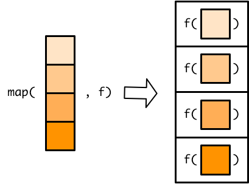

# Basic map functions


```r
library(tidyverse)
```

## Iteration as an assembly line

You'll often need to apply the same function to each element of a list or atomic vector. As an example, take `moons`, a list of vectors.


```r
moons <-
  list(
    earth = 1737.1,
    mars = c(11.3, 6.2),
    neptune = 
      c(60.4, 81.4, 156, 174.8, 194, 34.8, 420, 2705.2, 340, 62, 44, 42, 40, 60)
  )
```

(This data is from the Wikipedia pages on [Earth's Moon](https://en.wikipedia.org/wiki/Moon), [Mars's moons](https://en.wikipedia.org/wiki/Moons_of_Mars), and [Neptune's moons](https://en.wikipedia.org/wiki/Moons_of_Neptune)).

Each vector in `moons` represents a planet. The elements of each vector represent the radii of that planet's moons, in kilometers. (Note that some moons are irregularly shaped, so these are average radii.) 

Say we want to figure out the number of moons that belong to each planet by taking the length of each vector. We can't just apply `length()` to `moons`.


```r
length(moons)
#> [1] 3
```

`length(moons)` returns the number of planets in `moons`. Instead, we need to apply `length()` to each vector in `moons`. We could find the length of each vector by individually pulling out each one and then applying `length()`.


```r
length(moons$earth)
#> [1] 1
length(moons$mars)
#> [1] 2
length(moons$neptune)
#> [1] 14
```

This strategy is tedious and repetitive, and would be even more tedious and repetitive if `moons` contained more planets. Fortunately, we can use functions from the purrr package to iterate through vectors and do the same thing to each element. In this reading, you'll learn about the most basic purrr functions: the map functions. 

Take a look at the [purrr cheatsheet](https://github.com/rstudio/cheatsheets/blob/master/purrr.pdf) for an overview of all the purrr functions.

The map functions are like an assembly line in a factory. One conveyor belt, the *input belt*, transports various objects to a worker. The worker picks up each object and does something with it, but, importantly, never changes the object itself. For example, she might make a mold of the object, or grab a piece of plastic corresponding to the color of the object. Then, she places her new creation (the mold, piece of plastic, etc.) on the *output belt*. She does this until there are no new objects to process on the input belt and the conveyor belt stops. The factory then ends up with the same number of output objects as came in on the input belt. 

Imagine the map functions as this factory. You supply the map function with a list or vector (the objects on the input conveyor belt) and a function (what the worker does with each object). Then, the map function makes the conveyor belts run, applying the function to each element in the original vector to create a new vector of the same length, while never changing the original. 

In our `moons` example, the elements on the input belt are the vectors of moon radii. We want the worker to take the length of each vector by applying `length()`, producing three numbers on the output belt, each indicating a number of moons. In the next section, we'll show you exactly how to carry out this operation with the map functions.
  
## The map functions

We'll explain the most general map function, `map()`, first. `map()`, like all the map functions, takes a list/vector and a function as arguments.


(All diagrams were adapted from https://adv-r.hadley.nz/functionals.html.)

`map()` then applies that function to each element of the input list/vector.



Applying the function to each element of the input list/vector results in one output element for each input element.


`map()` then combines all these output elements into a list.


In the assembly line metaphor, the input list/vector is the container for the items that go on the conveyor belt. The function specifies what the worker should do with each item. The items on the output conveyor belt make up the list that `map()` returns once it's done.

In our example, `moons` is our input. We want to apply `length()` to each element of `moons`, so `length` is the function. 


Each call to `length()` produces an integer, so the result is a list of integers.


Here's what the call to `map()` looks like:


```r
map(moons, length)
#> $earth
#> [1] 1
#> 
#> $mars
#> [1] 2
#> 
#> $neptune
#> [1] 14
```

Note that we used `length`, not `length()`, to specify which function to use. `length()` calls the function, while `length` refers to the function object.

As we already said, `map()` returns a list.


```r
typeof(map(moons, length))
#> [1] "list"
```

A list of integers is fine, but you'll often rather have an atomic vector of integers. purrr also contains variants of `map()` that produce atomic vectors. There is one variant for each type of atomic vector.

* `map_int()` creates an integer vector.
* `map_dbl()` creates a double vector.
* `map_chr()` creates a character vector.
* `map_lgl()` creates a logical vector.


`length()` returns integers, so we'll use `map_int()` to create an integer vector instead of a list.


```r
map_int(moons, length)
#>   earth    mars neptune 
#>       1       2      14
```

The result looks similar to the result we got from `map()`, but is now an integer vector.


```r
typeof(map_int(moons, length))
#> [1] "integer"
```

`map_int()` requires that each output element be an integer.


If each element is an integer, `map_int()` can then combine all the elements into a single atomic vector.


The other variants of `map()` that produce double, character, and logical vectors work in the same way. 

We could use `map()` and `median()` to find the median moon radius for each planet.


```r
map(moons, median)
#> $earth
#> [1] 1737
#> 
#> $mars
#> [1] 8.75
#> 
#> $neptune
#> [1] 71.7
```

Or, we could use `map_dbl()` to produce a vector of doubles.


```r
map_dbl(moons, median)
#>   earth    mars neptune 
#> 1737.10    8.75   71.70
```

Mars has very small moons!

Use `map_chr()` to create a character vector when using a function that produces characters, and `map_lgl()` to create logical vectors.


```r
map_lgl(moons, is.double)
#>   earth    mars neptune 
#>    TRUE    TRUE    TRUE
```

The map variants that produce atomic vectors will throw an error if your function doesn't output the correct type. 


```r
map_int(moons, median)
#> Error: Can't coerce element 1 from a double to a integer
```

`median()` returns doubles, but `map_int()` expects integers, and cannot coerce doubles into integers. If you get a "Can't coerce" error when working with map functions, you're likely using the wrong variant. 

Some functions return vectors. For example, `sort()` returns a sorted version of a vector.


```r
sort(moons$neptune)
#>  [1]   34.8   40.0   42.0   44.0   60.0   60.4   62.0   81.4  156.0  174.8
#> [11]  194.0  340.0  420.0 2705.2
```

Even though `sort()` returns a vector of doubles, we can't use `map_dbl()` to apply `sort()` to each element of `moons`.


```r
map_dbl(moons, sort)
#> Error: Result 2 must be a single double, not a double vector of length 2
```

`map_dbl()` requires that the function return a *single* double for each element of `moons` because atomic vectors can't contain other vectors. `sort()` returns a vector of doubles for each element, so `map_dbl()` fails.

Instead, we have to use `map()` to combine the individual output vectors into a list. 


```r
map(moons, sort)
#> $earth
#> [1] 1737
#> 
#> $mars
#> [1]  6.2 11.3
#> 
#> $neptune
#>  [1]   34.8   40.0   42.0   44.0   60.0   60.4   62.0   81.4  156.0  174.8
#> [11]  194.0  340.0  420.0 2705.2
```

Because `map()` creates lists, it's very flexible. We just used `map()` to create a list of vectors, but you can also use `map()` to create lists of lists, lists of lists of lists, lists of tibbles, lists of functions, etc.

### Extra arguments

In the previous section, we used `sort()` to arrange each vector. By default, `sort()` arranges in increasing order.


```r
map(moons, sort)
#> $earth
#> [1] 1737
#> 
#> $mars
#> [1]  6.2 11.3
#> 
#> $neptune
#>  [1]   34.8   40.0   42.0   44.0   60.0   60.4   62.0   81.4  156.0  174.8
#> [11]  194.0  340.0  420.0 2705.2
```

To sort in decreasing order, we have to specify `decreasing = TRUE` inside of `sort()`. Outside of a map function, we would just put `decreasing = TRUE` into the function call.


```r
sort(moons$neptune, decreasing = TRUE)
#>  [1] 2705.2  420.0  340.0  194.0  174.8  156.0   81.4   62.0   60.4   60.0
#> [11]   44.0   42.0   40.0   34.8
```

Inside a map function, you put function arguments directly after the function name.


```r
map(moons, sort, decreasing = TRUE)
#> $earth
#> [1] 1737
#> 
#> $mars
#> [1] 11.3  6.2
#> 
#> $neptune
#>  [1] 2705.2  420.0  340.0  194.0  174.8  156.0   81.4   62.0   60.4   60.0
#> [11]   44.0   42.0   40.0   34.8
```

You can add as many arguments as you like, and `map()` will automatically supply them to the function.


For example, the following code uses two additional arguments to find the 95th quantile for each planet, excluding missing values. 


```r
moons %>% 
  map_dbl(quantile, probs = 0.95, na.rm = TRUE)
#>   earth    mars neptune 
#>    1737      11    1220
```

### Anonymous functions

So far in the reading, we've only given map **named** functions. Recall that named functions have a name which you can use to call the function. 

Say we want to convert the moon radii from kilometers to miles. Here's a named function that turns kilometers into miles.


```r
km_to_miles <- function(x) {
  x * 0.62
}
```

Anytime we want to convert kilometers to miles, we can now call `km_to_miles()`.


```r
km_to_miles(22)
#> [1] 13.6
```

Now, we can use `km_to_miles()` and `map()` to convert all moon radii to miles. We have to use `map()` because `km_to_miles()` will return a vector for each planet.


```r
map(moons, km_to_miles)
#> $earth
#> [1] 1077
#> 
#> $mars
#> [1] 7.01 3.84
#> 
#> $neptune
#>  [1]   37.4   50.5   96.7  108.4  120.3   21.6  260.4 1677.2  210.8   38.4
#> [11]   27.3   26.0   24.8   37.2
```

If we're not going to use `km_to_miles()` again, we don't need to make a named function. It will be less work and more succinct to just create an anonymous function inside `map()`. Recall that anonymous functions are just functions without names, and the full syntax  looks like this:


```r
function(x) x * 0.62
#> function(x) x * 0.62
```

We can copy this anonymous function directly into `map()`.


```r
map(moons, function(x) x * 0.62)
#> $earth
#> [1] 1077
#> 
#> $mars
#> [1] 7.01 3.84
#> 
#> $neptune
#>  [1]   37.4   50.5   96.7  108.4  120.3   21.6  260.4 1677.2  210.8   38.4
#> [11]   27.3   26.0   24.8   37.2
```

The full syntax for anonymous functions is clunky, so purrr provides a shortcut. Here's what the code looks like if we use the shortcut:


```r
moons %>% 
  map(~ . * 0.62)
#> $earth
#> [1] 1077
#> 
#> $mars
#> [1] 7.01 3.84
#> 
#> $neptune
#>  [1]   37.4   50.5   96.7  108.4  120.3   21.6  260.4 1677.2  210.8   38.4
#> [11]   27.3   26.0   24.8   37.2
```

The `~` tells `map()` that an anonymous function is coming. The `.` refers to the function argument, taking the place of `x` from the full anonymous function syntax. 

Just like when you supply `map()` with a named function, `map()` will apply an anonymous function to each element of `moons`. You can think of `.` as a placeholder, referring to `earth`, then `mars`, and then `neptune` as the conveyor belt delivers the vector of each planet's moons to the worker.


If a named function does not exist for your mapping, we recommend using an anonymous function instead of creating a named function, unless you'll use the function again or the function is very long. We also recommend always using the syntax shortcut instead of the full anonymous function syntax. 

Anonymous functions can be confusing and tricky to get right. If you're struggling to get the syntax correct, try testing your anonymous function on just a single element of your list. Here, we'll explain one strategy for doing so.

First, assign a single element of your list to the variable `.`. This looks strange, but means you'll end up with a function that uses the purrr anonymous function syntax. 


```r
. <- moons[[3]]
.
#>  [1]   60.4   81.4  156.0  174.8  194.0   34.8  420.0 2705.2  340.0   62.0
#> [11]   44.0   42.0   40.0   60.0
```

(We picked the third element because Neptune is more interesting than Earth, but it's usually easiest to simply pick the first element with `[[1]]`.)

Then, figure out how to perform your desired operation on just that element. Check that the output is correct.


```r
. * 0.62
#>  [1]   37.4   50.5   96.7  108.4  120.3   21.6  260.4 1677.2  210.8   38.4
#> [11]   27.3   26.0   24.8   37.2
```

Now, copy and paste your code into `map()`. Just remember to put a `~` at the beginning.


```r
moons %>% 
  map(~ . * 0.62)
#> $earth
#> [1] 1077
#> 
#> $mars
#> [1] 7.01 3.84
#> 
#> $neptune
#>  [1]   37.4   50.5   96.7  108.4  120.3   21.6  260.4 1677.2  210.8   38.4
#> [11]   27.3   26.0   24.8   37.2
```

Let's walk through a more complicated example. Say you want to find the number of large moons that belong to each planet. We'll define a large moon as a moon with a radius greater than 100 kilometers.

First, assign an element of your list to `.`.


```r
. <- moons[[3]]
.
#>  [1]   60.4   81.4  156.0  174.8  194.0   34.8  420.0 2705.2  340.0   62.0
#> [11]   44.0   42.0   40.0   60.0
```

Then, build and test your function just for `.`. 

First, we need to subset `.` so that it just includes moon radii greater than 100. Recall the syntax for subsetting vectors. `x[x == 1]` extracts just the elements of some vector `x` that are equal to 1. `x[x > 2]` gives you all the elements of `x` greater than 2. Use this syntax to extract the moon radii in `.` that are greater than 100. 


```r
.[. > 100]
#> [1]  156  175  194  420 2705  340
```

Then, take the length of this new vector to find the number of moons it contains.


```r
length(.[. > 100])
#> [1] 6
```

Now, copy and paste your code into a map function after a `~`. We'll use `map_int()` because `length()` returns integers.


```r
moons %>% 
  map_int(~ length(.[. > 100]))
#>   earth    mars neptune 
#>       1       0       6
```

This strategy makes the purrr anonymous function syntax less abstract and allows you to test your anonymous functions before plugging them into a map function.

### Tibbles

All the examples so far have used the map function on `moons`, a list of vectors, but the map functions work on any type of vector or list, including tibbles. 

Tibbles are lists of vectors. Notice that when you create a tibble with `tibble()`, you create a vector for each column.


```r
y <- 
  tibble(
    col_1 = c(1, 2, 3),
    col_2 = c(100, 200, 300),
    col_3 = c(0.1, 0.2, 0.3)
  )
```

Because the elements of a tibble are the vector columns, map functions act on the tibble columns, not the tibble rows.


```r
map_dbl(y, median)
#> col_1 col_2 col_3 
#>   2.0 200.0   0.2
```

Here's another example that finds the number of `NA`'s in each column of `nycflights13::flights`.


```r
nycflights13::flights %>% 
  map_int(~ sum(is.na(.)))
#>           year          month            day       dep_time sched_dep_time 
#>              0              0              0           8255              0 
#>      dep_delay       arr_time sched_arr_time      arr_delay        carrier 
#>           8255           8713              0           9430              0 
#>         flight        tailnum         origin           dest       air_time 
#>              0           2512              0              0           9430 
#>       distance           hour         minute      time_hour 
#>              0              0              0              0
```
