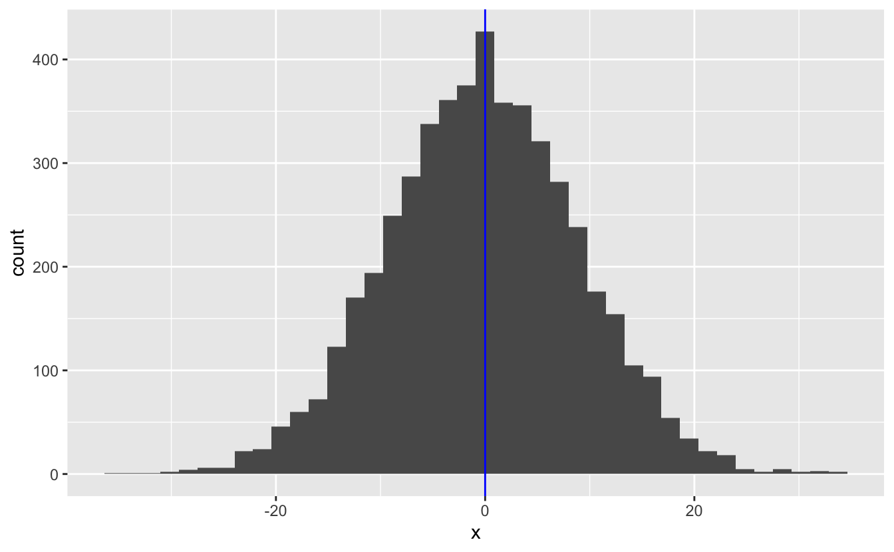

# Other purrr functions


```r
library(tidyverse)
```

In this reading, you'll learn about two more map variants, `map_dfr()` and `map_dfc()`. Then, you'll learn about `walk()`, as well as some useful purrr functions that work with functions that return either `TRUE` or `FALSE`.

The purrr package contains more functions than we can cover. The [purrr cheatsheet](https://github.com/rstudio/cheatsheets/blob/master/purrr.pdf) is a great way to find helpful functions when you encounter a new type of iteration problem.

## Map functions that output tibbles

Instead of creating an atomic vector or list, the map variants `map_dfr()` and `map_dfc()` create a tibble. 

With these map functions, the assembly line worker creates a tibble for each input element, and the output conveyor belt ends up with a collection of tibbles. 


The worker then combines all the small tibbles into a single, larger tibble. There are multiple ways to combine smaller tibbles into a larger tibble. `map_dfr()` (*r* for *rows*) stacks the smaller tibbles on top of each other. 


`map_dfc()` (*c* for *columns*) stacks them side-by-side.


There are `_dfr` and `_dfc` variants of `pmap()` and `map2()` as well. In the following sections, we'll cover `map_dfr()` and `map_dfc()` in more detail.

### `_dfr`

`map_dfr()` is useful when reading in data from multiple files. The following code reads in several very simple csv files, each of which contains the name of a different dinosaur genus.


```r
read_csv("data/purrr-extras/file_001.csv")
#> # A tibble: 1 × 2
#>      id genus        
#>   <dbl> <chr>        
#> 1     1 Hoplitosaurus

read_csv("data/purrr-extras/file_002.csv")
#> # A tibble: 1 × 2
#>      id genus        
#>   <dbl> <chr>        
#> 1     2 Herrerasaurus

read_csv("data/purrr-extras/file_003.csv")
#> # A tibble: 1 × 2
#>      id genus      
#>   <dbl> <chr>      
#> 1     3 Coelophysis
```

`read_csv()` produces a tibble, and so we can use `map_dfr()` to map over all three file names and bind the resulting individual tibbles into a single tibble.


```r
files <- str_glue("data/purrr-extras/file_00{1:3}.csv")
files
#> data/purrr-extras/file_001.csv
#> data/purrr-extras/file_002.csv
#> data/purrr-extras/file_003.csv

files %>% 
  map_dfr(read_csv)
#> # A tibble: 3 × 2
#>      id genus        
#>   <dbl> <chr>        
#> 1     1 Hoplitosaurus
#> 2     2 Herrerasaurus
#> 3     3 Coelophysis
```

The result is a tibble with three rows and two columns, because `map_dfr()` aligns the columns of the individual tibbles by name. 

The individual tibbles can have different numbers of rows or columns. `map_dfr()` just creates a column for each unique column name. If some of the individual tibbles lack a column that others have, `map_dfr()` fills in with `NA` values.


```r
read_csv("data/purrr-extras/file_004.csv")
#> # A tibble: 2 × 3
#>      id genus         start_period 
#>   <dbl> <chr>         <chr>        
#> 1     4 Dilophosaurus Sinemurian   
#> 2     5 Segisaurus    Pliensbachian

c(files, "data/purrr-extras/file_004.csv") %>% 
  map_dfr(read_csv)
#> # A tibble: 5 × 3
#>      id genus         start_period 
#>   <dbl> <chr>         <chr>        
#> 1     1 Hoplitosaurus <NA>         
#> 2     2 Herrerasaurus <NA>         
#> 3     3 Coelophysis   <NA>         
#> 4     4 Dilophosaurus Sinemurian   
#> 5     5 Segisaurus    Pliensbachian
```

### `_dfc`

`map_dfc()` is typically less useful than `map_dfr()` because it relies on row position to stack the tibbles side-by-side. Row position is prone to error, and it will often be difficult to check if the data in each row is aligned correctly. However, if you have data with variables in different places and are positive the rows are aligned, `map_dfc()` may be appropriate.

Unfortunately, even if the individual tibbles contain a unique identifier for each row, `map_dfc()` doesn't use the identifiers to verify that the rows are aligned correctly, nor does it combine identically named columns.


```r
read_csv("data/purrr-extras/file_005.csv")
#> # A tibble: 1 × 3
#>      id diet      start_period
#>   <dbl> <chr>     <chr>       
#> 1     1 herbivore Barremian

c("data/purrr-extras/file_001.csv", "data/purrr-extras/file_005.csv") %>% 
  map_dfc(read_csv)
#> # A tibble: 1 × 5
#>   id...1 genus         id...3 diet      start_period
#>    <dbl> <chr>          <dbl> <chr>     <chr>       
#> 1      1 Hoplitosaurus      1 herbivore Barremian
```

Instead, you end up with a duplicated column (`id...1` and `id...3`).

If you have a unique identifier for each row, it is much better to join on that identifier.


```r
left_join(
  read_csv("data/purrr-extras/file_001.csv"),
  read_csv("data/purrr-extras/file_005.csv"),
  by = "id"
)
#> # A tibble: 1 × 4
#>      id genus         diet      start_period
#>   <dbl> <chr>         <chr>     <chr>       
#> 1     1 Hoplitosaurus herbivore Barremian
```

Also, because `map_dfc()` combines tibbles by row position, the tibbles can have different numbers of columns, but they should have the same number of rows.

## Walk

The walk functions work similarly to the map functions, but you use them when you're interested in applying a function that performs an action instead of producing data (e.g., `print()`). 

The walk functions are useful for performing actions like writing files and printing plots. For example, say we used purrr to generate a list of plots.


```r
set.seed(745)

plot_rnorm <- function(sd) {
  tibble(x = rnorm(n = 5000, mean = 0, sd = sd)) %>% 
    ggplot(aes(x)) +
    geom_histogram(bins = 40) +
    geom_vline(xintercept = 0, color = "blue")
}

plots <-
  c(5, 1, 9) %>% 
  map(plot_rnorm)
```

We can now use `walk()` to print them out.


```r
plots %>% 
  walk(print)
```



The walk functions look like they don't return anything, but they actually return their input *invisibly*. When functions return something invisibly, it just means they don't print their return value out when you call them. This functionality makes the walk functions useful in pipes. You can call a walk function to perform an action, get your input back, and continue operating on that input. 

## Predicate functions

In Chapter 7, we introduced _predicate functions_, which are functions that return a single `TRUE` or `FALSE`. purrr includes several useful functions that work with predicate functions. 

`keep()` and `discard()` iterate over a vector and keep or discard only those elements for which the predicate function returns `TRUE`. 


```r
x <-
  list(
    a = c(1, 2),
    b = c(4, 5, 6),
    c = c("a", "z")
  )

x %>% 
  discard(is.character)
#> $a
#> [1] 1 2
#> 
#> $b
#> [1] 4 5 6
```


```r
x %>% 
  keep(~ length(.) == 2)
#> $a
#> [1] 1 2
#> 
#> $c
#> [1] "a" "z"
```

With tibbles, you can use `keep()` and `discard()` to select columns that meet a certain condition.


```r
mpg %>% 
  keep(is.numeric)
#> # A tibble: 234 × 5
#>   displ  year   cyl   cty   hwy
#>   <dbl> <int> <int> <int> <int>
#> 1   1.8  1999     4    18    29
#> 2   1.8  1999     4    21    29
#> 3   2    2008     4    20    31
#> 4   2    2008     4    21    30
#> 5   2.8  1999     6    16    26
#> 6   2.8  1999     6    18    26
#> # … with 228 more rows
```

`some()` looks at the entire input vector and returns `TRUE` if the predicate is true for any element of the vector and `FAlSE` otherwise.


```r
mpg %>% 
  some(is.numeric)
#> [1] TRUE
```

For `every()` to return `TRUE`, every element of the vector must meet the predicate.


```r
mpg %>% 
  every(is.numeric)
#> [1] FALSE
```

Other useful purrr functions that use predicate functions include `head_while()`, `compact()`, `has_element()`, and `detect()`. Take a look at the [purrr cheatsheet](https://github.com/rstudio/cheatsheets/blob/master/purrr.pdf) for details. 

