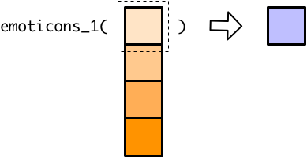
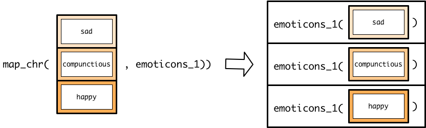
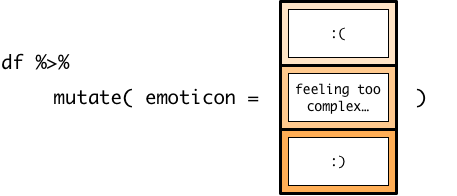

# purrr inside mutate


```r
library(tidyverse)
```

In the vector functions unit, you learned that `mutate()` creates new columns by creating vectors that contain an element for each row in the tibble. You saw that you can do any of the following to create this vector:

* Give `mutate()` a single value, which is then repeated for each row in the tibble.
* Explicitly give `mutate()` a vector with an element for each row in the tibble.
* Create a vector using a vector function like `+` or `case_when()`.

The purrr map functions are technically vector functions. They take a vector as input and return a vector of the same length as output. In this reading, we'll show you how to use map functions inside `mutate()` to create a new column.

`emoticons_1()` is a simple scalar function that turns feelings into emoticons.


```r
emoticons_1 <- function(x) {
  if (x == "happy") {
    ":)"
  } else if (x == "sad") {
    ":("
  } else {
    "Feeling too complex for emoticons"
  }
}
```

Recall that scalar functions take a single value and return a single value.


If you try to apply a scalar function to a vector, the scalar function will only process the first element of that vector.



Let's say we want to use `emoticons_1()` to translate some feelings into emoticons. `df` is a small tibble that represents some feelings.


```r
df <- 
  tibble(
    feeling = c("sad", "compunctious", "happy")
  ) 
```

We can't just use `mutate()` and `emoticons_1()` to add a new column because, like we said, `emoticons_1()` can't handle vectors. 


```r
df %>% 
  mutate(emoticon = emoticons_1(feeling))
#> Warning in if (x == "happy") {: the condition has length > 1 and only the first
#> element will be used
#> Warning in if (x == "sad") {: the condition has length > 1 and only the first
#> element will be used
#> # A tibble: 3 x 2
#>   feeling      emoticon
#>   <chr>        <chr>   
#> 1 sad          :(      
#> 2 compunctious :(      
#> 3 happy        :(
```

We could change `emoticons_1()` into a vector function by replacing `if` and `else` with `if_else()`, `case_when()`, or `recode()`. However, you often won't have control over the source code of the functions you want to use, and there will be many circumstances when you can't change a scalar function into a vector function.

Instead of turning `emoticons_1()` into a vector function, we'll use `map_chr()` to apply `emoticons_1()` to each element of `feeling`, creating a vector of emoticons.

You already know how to apply map functions to ordinary vectors. Let's pull `feeling` out of `df` to see what happens when we use `map_chr()` to apply `emoticons_1()`.


```r
feeling <- df$feeling

map_chr(feeling, emoticons_1)
#> [1] ":("                                "Feeling too complex for emoticons"
#> [3] ":)"
```

Now, we can plug this map statement into `mutate()` to apply `emoticons_1()` to each feeling in `df`.


```r
df %>% 
  mutate(emoticon = map_chr(feeling, emoticons_1))
#> # A tibble: 3 x 2
#>   feeling      emoticon                         
#>   <chr>        <chr>                            
#> 1 sad          :(                               
#> 2 compunctious Feeling too complex for emoticons
#> 3 happy        :)
```

`map_chr()` does the same thing inside `mutate()` as it does outside. 


The `feeling` column is just a vector, so the entire vector of emotions is supplied to `map_chr()`.


Then, `map_chr()` applies `emoticons_1()` to each element of `feelings`.



This results in a vector of values that `mutate()` can turn into a new column.



You can use a map function inside `mutate()` to apply any scalar function to each element of a column, but remember to think about which map variant you need. If the output type of the scalar function doesn't match the map function suffix, you'll get an error about coercion.


```r
df %>% 
  mutate(emoticon = map_int(feeling, emoticons_1))
#> Error: `mutate()` argument `emoticon` errored.
#> ℹ `emoticon` is `map_int(feeling, emoticons_1)`.
#> x Can't coerce element 1 from a character to a integer
```

The map functions work exactly the same inside `mutate()` as they do outside. You still specify additional arguments by listing them after the function.


```r
emoticons_2 <- function(x, default = "???") {
  if (x == "happy") {
    ":)"
  } else if (x == "sad") {
    ":("
  } else {
    default
  }
}

df %>% 
  mutate(emoticon = map_chr(feeling, emoticons_2, default = NA_character_))
#> # A tibble: 3 x 2
#>   feeling      emoticon
#>   <chr>        <chr>   
#> 1 sad          :(      
#> 2 compunctious <NA>    
#> 3 happy        :)
```

You can also still create anonymous functions.


```r
df %>% 
  mutate(statement = map_chr(feeling, ~ str_c("I feel ", emoticons_2(.))))
#> # A tibble: 3 x 2
#>   feeling      statement 
#>   <chr>        <chr>     
#> 1 sad          I feel :( 
#> 2 compunctious I feel ???
#> 3 happy        I feel :)
```

Remember that, in purrr functions, you start an anonymous function with `~`. The `.` refers to one element of the `feeling` column at a time. 

In the previous chapter, we demonstrated a strategy for creating anonymous functions. We'll show you how to apply this strategy when working with purrr functions inside `mutate()`.

The first step is still to assign an element of your input vector to `.`. Now, the input vector is a tibble column, so you'll need to first pull out the tibble column before accessing the first element.


```r
. <- df$feeling[[1]]
```

Next, you can build and test your function on `.`.


```r
str_c("I feel ", emoticons_2(.))
#> [1] "I feel :("
```

Finally, just copy and paste your function after a `~` inside your map call.


```r
df %>% 
  mutate(statement = map_chr(feeling, ~ str_c("I feel ", emoticons_2(.))))
#> # A tibble: 3 x 2
#>   feeling      statement 
#>   <chr>        <chr>     
#> 1 sad          I feel :( 
#> 2 compunctious I feel ???
#> 3 happy        I feel :)
```

