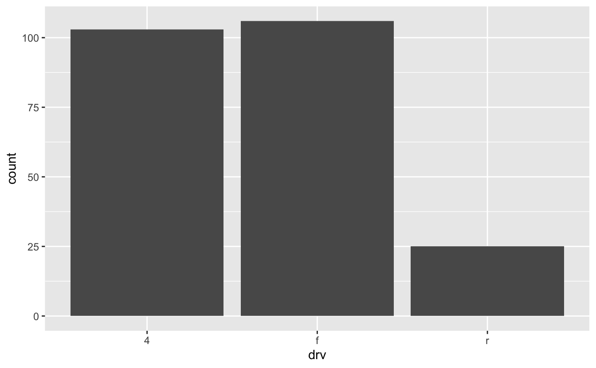

# Tidy evaluation basics


Likely without realizing it, you've been using two types of variables in R. First, there are what we'll call _environment_ variables. When you create an environment variable, you bind a value to a name in the current environment. For example, the following code creates an environment variable named `y` that refers to `1`.


```r
y <- 1
```

Now, when we call `y`, we get whatever value `y` refers to. 


```r
y
#> [1] 1
```

The second type of variable we'll call _data_ variables. Data variables refer to columns in data frames, and only make sense in the context of those data frames. For example, `manufacturer` is a data variable that exists in the context of `mpg`. dplyr, ggplot2, and other tidyverse packages understand this, which is why functions like `select()` behave as you want.


```r
mpg %>% 
  select(manufacturer)
#> # A tibble: 234 × 1
#>   manufacturer
#>   <chr>       
#> 1 audi        
#> 2 audi        
#> 3 audi        
#> 4 audi        
#> 5 audi        
#> 6 audi        
#> # … with 228 more rows
```

Instead of figuring out what `manufacturer` refers to in the environment, `select()` looks for a column named "manufacturer" in `mpg`. 

Let's take a look at our failed function from the intro again.


```r
grouped_mean <- function(var_group, var_summary) {
  mpg %>% 
    group_by(var_group) %>% 
    summarize(mean = mean(var_summary))
}

grouped_mean(var_group = manufacturer, var_summary = cty)
#> Error: Must group by variables found in `.data`.
#> * Column `var_group` is not found.
```

`group_by()` thinks that `var_group` is a data variable, and so it looks inside `mpg` for a column called "var_group", doesn't find it, and so throws an error. 

We actually want `var_group` to behave as a hybrid between an environment variable and a data variable. Like an environment variable, we want it to refer to another value (`manufacturer`). Then, we want `group_by()` to treat that value (`manufacturer`) as a data variable and look inside `mpg` for the matching column.

## Embracing with `{{ }}`

To fix `grouped_mean()`, all we need to do is _embrace_ `var_group` and `var_summary` with `{{ }}` (pronounced "curly curly").


```r
grouped_mean <- function(var_group, var_summary) {
  mpg %>% 
    group_by({{ var_group }}) %>% 
    summarize(mean = mean({{ var_summary }}))
}

grouped_mean(var_group = manufacturer, var_summary = cty)
#> # A tibble: 15 × 2
#>   manufacturer  mean
#>   <chr>        <dbl>
#> 1 audi          17.6
#> 2 chevrolet     15  
#> 3 dodge         13.1
#> 4 ford          14  
#> 5 honda         24.4
#> 6 hyundai       18.6
#> # … with 9 more rows
```

`{{ }}` might remind you of the use of `{ }` in `glue()`, and they fill similar roles. 

Let's look at another example. This doesn't work:


```r
plot_mpg <- function(var) {
  mpg %>% 
    ggplot(aes(var)) +
    geom_bar()
}

plot_mpg(drv)
#> Error in FUN(X[[i]], ...): object 'drv' not found
```

We want `var` to behave as a hybrid environment-data variable, so we need `{{ }}`.


```r
plot_mpg <- function(var) {
  mpg %>% 
    ggplot(aes({{ var }})) +
    geom_bar()
}

plot_mpg(drv)
```



## Forwarding with `...`

You might have noticed that some functions, like the purrr functions, take `...` as a final argument, allowing you to specify any number of additional arguments. You can use `...` in your own functions. There are two common use-cases.

### Passing full expressions

Functions like `filter()` take expressions, like `year == 1999` or `manufacturer == "audi"`. If you want to build a function that takes full expressions, you can use `...`.


```r
mpg_filter <- function(...) {
  mpg %>% 
    filter(...)
}

mpg_filter(manufacturer == "audi", year == 1999)
#> # A tibble: 9 × 11
#>   manufacturer model      displ  year   cyl trans  drv     cty   hwy fl    class
#>   <chr>        <chr>      <dbl> <int> <int> <chr>  <chr> <int> <int> <chr> <chr>
#> 1 audi         a4           1.8  1999     4 auto(… f        18    29 p     comp…
#> 2 audi         a4           1.8  1999     4 manua… f        21    29 p     comp…
#> 3 audi         a4           2.8  1999     6 auto(… f        16    26 p     comp…
#> 4 audi         a4           2.8  1999     6 manua… f        18    26 p     comp…
#> 5 audi         a4 quattro   1.8  1999     4 manua… 4        18    26 p     comp…
#> 6 audi         a4 quattro   1.8  1999     4 auto(… 4        16    25 p     comp…
#> # … with 3 more rows
```

`...` can take any number of arguments, so we can filter by an unlimited number of conditions.


```r
mpg_filter(
  manufacturer == "audi", 
  year == 1999, 
  drv == "f", 
  fl == "p"
)
#> # A tibble: 4 × 11
#>   manufacturer model displ  year   cyl trans      drv     cty   hwy fl    class 
#>   <chr>        <chr> <dbl> <int> <int> <chr>      <chr> <int> <int> <chr> <chr> 
#> 1 audi         a4      1.8  1999     4 auto(l5)   f        18    29 p     compa…
#> 2 audi         a4      1.8  1999     4 manual(m5) f        21    29 p     compa…
#> 3 audi         a4      2.8  1999     6 auto(l5)   f        16    26 p     compa…
#> 4 audi         a4      2.8  1999     6 manual(m5) f        18    26 p     compa…
```

`mpg_filter()` _forwards_ `...` to `filter()`, which allows `filter()` to act on the contents of `...` just as it would outside of the function.

Here's another example that uses `select()`.


```r
mpg_select <- function(...) {
  mpg %>% 
    select(...)
}

mpg_select(car = model, drivetrain = drv)
#> # A tibble: 234 × 2
#>   car   drivetrain
#>   <chr> <chr>     
#> 1 a4    f         
#> 2 a4    f         
#> 3 a4    f         
#> 4 a4    f         
#> 5 a4    f         
#> 6 a4    f         
#> # … with 228 more rows
```

### Additional arguments

Sometimes, you'll want your function to take named arguments, but you'll also want to allow for any number of additional arguments. You can use `{{ }}`, and `...`.


```r
grouped_mean_2 <- function(df, var_summary, ...) {
  df %>% 
    group_by(...) %>% 
    summarize(mean = mean({{ var_summary }})) %>% 
    ungroup()
}

grouped_mean_2(df = mpg, var_summary = cty, year, drv)
#> # A tibble: 6 × 3
#>    year drv    mean
#>   <int> <chr> <dbl>
#> 1  1999 4      14.2
#> 2  1999 f      20.0
#> 3  1999 r      14  
#> 4  2008 4      14.4
#> 5  2008 f      20.0
#> 6  2008 r      14.1
```

With the `...`, we can pass any number of grouping variables into `group_by()`.


```r
grouped_mean_2(df = mpg, var_summary = cty, year, drv, class)
#> # A tibble: 23 × 4
#>    year drv   class       mean
#>   <int> <chr> <chr>      <dbl>
#> 1  1999 4     compact     16.5
#> 2  1999 4     midsize     15  
#> 3  1999 4     pickup      13  
#> 4  1999 4     subcompact  19.5
#> 5  1999 4     suv         13.8
#> 6  1999 f     compact     20.4
#> # … with 17 more rows
```

## Assigning names

When you want to pass the name of a column into your function, you need to:

* Embrace the name with `{{ }}`.
* Use `:=` instead of `=` to assign the name.


```r
summary_mean <- function(df, var_summary, name_summary){ 
  df %>% 
    summarize({{ name_summary }} := mean({{ var_summary }}))
}

summary_mean(df = mpg, var_summary = cty, name_summary = cty_mean)
#> # A tibble: 1 × 1
#>   cty_mean
#>      <dbl>
#> 1     16.9
```

You have to use `:=` instead of just plain `=` because you can't use `{{ }}` on both sides of a `=`.

(`:=` is called the walrus operator because it looks like a sideways walrus.)

## Splicing with `!!!`

Say you want to recode a variable:


```r
mpg %>% 
  mutate(drv = recode(drv, "f" = "front", "r" = "rear", "4" = "four"))
#> # A tibble: 234 × 11
#>   manufacturer model displ  year   cyl trans      drv     cty   hwy fl    class 
#>   <chr>        <chr> <dbl> <int> <int> <chr>      <chr> <int> <int> <chr> <chr> 
#> 1 audi         a4      1.8  1999     4 auto(l5)   front    18    29 p     compa…
#> 2 audi         a4      1.8  1999     4 manual(m5) front    21    29 p     compa…
#> 3 audi         a4      2    2008     4 manual(m6) front    20    31 p     compa…
#> 4 audi         a4      2    2008     4 auto(av)   front    21    30 p     compa…
#> 5 audi         a4      2.8  1999     6 auto(l5)   front    16    26 p     compa…
#> 6 audi         a4      2.8  1999     6 manual(m5) front    18    26 p     compa…
#> # … with 228 more rows
```

It's often a good idea to store your recode mapping as a vector in your parameters section. To get this to work, you'll need another tidyeval operator, `!!!`. 


```r
recode_drv <- c(f = "front", r = "rear", "4" = "four")

mpg %>% 
  mutate(drv = recode(drv, !!! recode_drv))
#> # A tibble: 234 × 11
#>   manufacturer model displ  year   cyl trans      drv     cty   hwy fl    class 
#>   <chr>        <chr> <dbl> <int> <int> <chr>      <chr> <int> <int> <chr> <chr> 
#> 1 audi         a4      1.8  1999     4 auto(l5)   front    18    29 p     compa…
#> 2 audi         a4      1.8  1999     4 manual(m5) front    21    29 p     compa…
#> 3 audi         a4      2    2008     4 manual(m6) front    20    31 p     compa…
#> 4 audi         a4      2    2008     4 auto(av)   front    21    30 p     compa…
#> 5 audi         a4      2.8  1999     6 auto(l5)   front    16    26 p     compa…
#> 6 audi         a4      2.8  1999     6 manual(m5) front    18    26 p     compa…
#> # … with 228 more rows
```

`!!!` has two tasks:

* Unpack `recode_drv` so that each element is passed as a separate argument to `recode()` (i.e., `"f" = "front", "r" = "rear", "4" = "four"` instead of c(`"f" = "front", "r" = "rear", "4" = "four")`).
* Make sure that `recode()` treats the individual elements as data variables. 

