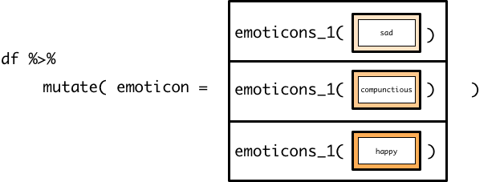

# purrr inside mutate

```{r message = FALSE}
library(tidyverse)
```

In the vector functions unit, you learned that `mutate()` creates new columns by creating vectors that contain an element for each row in the tibble. You saw that you can do any of the following to create this vector:

* Give `mutate()` a single value, which is then repeated for each row in the tibble.
* Explicitly give `mutate()` a vector with an element for each row in the tibble.
* Create a vector using a vector function like `+` or `case_when()`.

In this reading, you'll learn about a fourth option: supplying `mutate()` with a vector created by a `map` function.

## Using map functions inside `mutate()`

`emoticons_1()` is a simple scalar function that turns feelings into emoticons.

```{r}
emoticons_1 <- function(x) {
  if (x == "happy") {
    ":)"
  } else if (x == "sad") {
    ":("
  } else {
    "Feeling too complex for emoticons"
  }
}
```

Recall that scalar functions fail if you try to give them vectors of values:

```{r}
two_feelings <- c("happy", "befuddled")
emoticons_1(two_feelings)
```

We could turn `emoticons()` into a vector function by rewriting it using `if_else()`, `case_when()`, or `recode()`, but let's say we want to keep it as a scalar function or don't have control over the function source code. In that case, we need a way to apply `emoticons_1()` to each element of `two_feelings`, instead of just the first element. Recall that this is exactly what the map functions do.

```{r}
map_chr(two_feelings, emoticons_1)
```

`map_chr()` applies `emoticons_1()` to one element of `two_feelings` at time, so now we have an effective way of applying a scalar function to a vector. 

Now, say we want to use `emoticons_1()` inside `mutate()`.

`df` is a tibble representing some emotions. 

```{r}
df <- 
  tibble(
    feeling = c("sad", "compunctious", "happy")
  ) 
```

Our tibble column `feeling` is a vector, so `emoticons_1()` will also fail if we try to use it inside `mutate()` to create a new column.

```{r}
df %>% 
  mutate(emoticon = emoticons_1(feeling))
```

Instead, we can use a map function to apply `emoticons_1` to each element of the `feeling` column at a time.

```{r}
df %>% 
  mutate(emoticon = map_chr(feeling, emoticons_1))
```

Tibble columns are vector, so when we reference `feeling` inside `map_chr()`, we are supplying a vector.

```{r echo=FALSE}

```

`map_chr()` then applies `emoticons_1()` to each element of `feelings`,

```{r echo=FALSE}

```

producing a vector with an emoticon for each element of `feelings`.

```{r echo=FALSE}
knitr::include_graphics("images/map-mutate-emoticons-3.png")
```

This pattern will work with any scalar function, but remember to think about which map variant to use. If the output type of the scalar function doesn't match the suffix, you'll get an error about coercion.

```{r, error=TRUE}
df %>% 
  mutate(emoticon = map_int(feeling, emoticons_1))
```

## Additional arguments and anonymous values

You can use the map functions inside `mutate()` as you would outside `mutate()`, and so you can still specify additional arguments by listing them after the function.

```{r}
emoticons_2 <- function(x, default = "???") {
  if (x == "happy") {
    ":)"
  } else if (x == "sad") {
    ":("
  } else {
    default
  }
}

df %>% 
  mutate(emoticon = map_chr(feeling, emoticons_2, default = NA_character_))
```

You can also still create anonymous functions.

```{r}
df %>% 
  mutate(is_happy = map_chr(feeling, ~ str_c("I feel ", emoticons_2(.))))
```